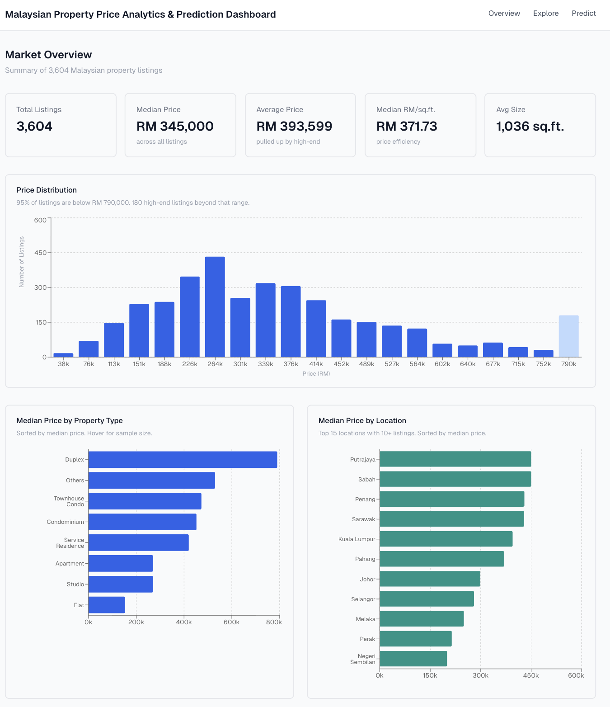

# Malaysian Property Price Analytics & Prediction Dashboard

A dashboard for exploring Malaysian property listings, visualizing price trends, and predicting property prices using machine learning.



## Dataset

Source: [Raw Malaysian Housing Prices Data](https://www.kaggle.com/datasets/mcpenguin/raw-malaysian-housing-prices-data?select=houses.csv) from Kaggle.

~3,600 cleaned property listings across Malaysia with features including property size, type, location, bedrooms, bathrooms, and price.

## Model

XGBoost regressor trained on the cleaned dataset. 
Features are one-hot encoded using pandas `get_dummies` and aligned to the training schema at inference time. 
The model predicts property price based on size, bedroom/bathroom count, facility count, property type, tenure type, land title, and location.

## Tech Stack

- **Frontend**: Next.js, React, TypeScript, Recharts, Tailwind CSS
- **Backend**: FastAPI, Pandas, NumPy, scikit-learn, XGBoost
- **ML Pipeline**: Jupyter notebooks for EDA and preprocessing

### Run locally

```bash
# Backend
cd api
pip install -r requirements.txt
uvicorn main:app --reload

# Frontend (in a separate terminal)
cd frontend
npm install
npm run dev
```

### Run with Docker

```bash
docker compose up --build
```

## Project Structure

```
├── api/                  # FastAPI backend
├── frontend/             # Next.js frontend
├── data/                 # Raw and cleaned datasets
├── model/                # Trained model and feature columns
├── 00_data_exploratory.ipynb
├── 01_data_preprocessing.ipynb
├── 02_EDA.ipynb
└── docker-compose.yml
```
